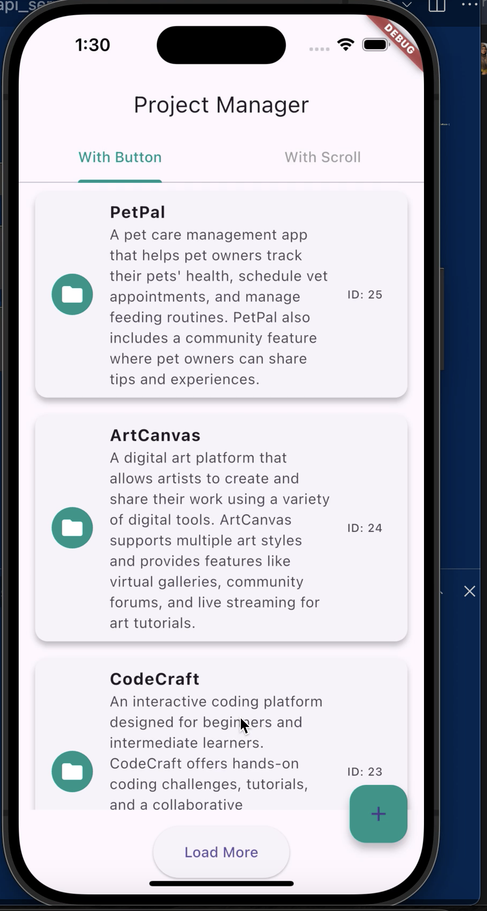
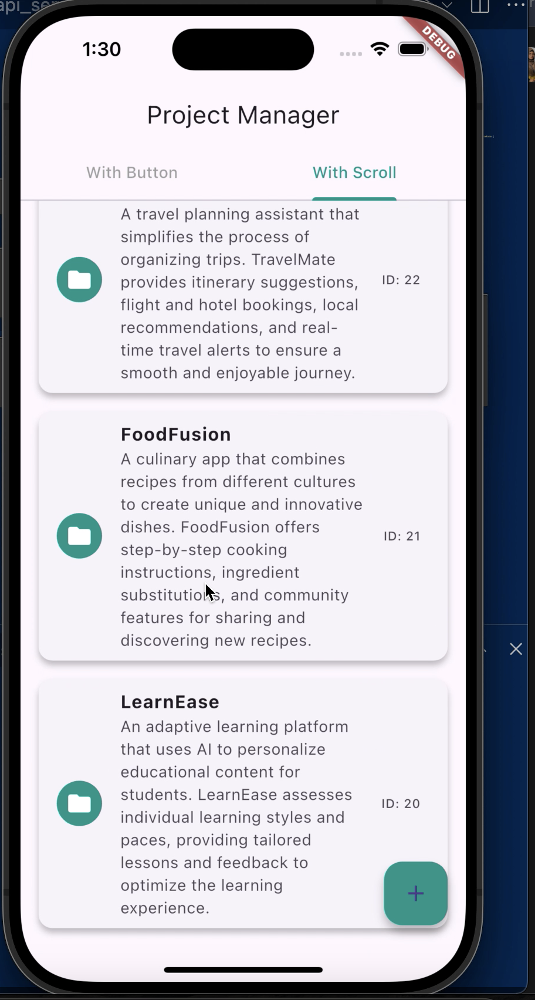

# Project Manager - Flutter Pagination Demo


A sleek and modern Flutter application showcasing two pagination styles—button-based and scroll-based—for managing projects fetched from an API. Built with a clean UI, tabs for easy navigation, and a consistent teal theme, this project demonstrates efficient data handling and responsive design.

## Features

- **Dual Pagination Modes**: Switch between button-based ("Load More" button) and scroll-based (infinite scroll) pagination.
- **Tab Navigation**: Intuitive tabs at the top for seamless switching between pagination styles.
- **Modern UI**: 
  - Teal-themed design with rounded project cards, shadows, and icons.
  - Floating Action Button for future "create project" functionality.
  - Pull-to-refresh to reload project data.
- **API Integration**: Fetches project data from a mock API (replaceable with your own endpoint).
- **Error Handling**: Displays errors via SnackBar notifications.
- **Responsive Design**: Optimized for mobile screens.

## Screenshots

| Home Screen (Tabs)       | Scroll Pagination         |
|--------------------------|---------------------------|
|    |


## Prerequisites

- **Flutter**: Version 3.x or higher
- **Dart**: Version 2.18 or higher
- **IDE**: Android Studio, VS Code, or any Flutter-supported IDE
- **Dependencies**: 
  - `http` package for API calls

## Getting Started

### 1. Clone the Repository
```bash
git clone https://github.com/minahil57/flutter_pagination
cd pagination
```
### 2. Install Dependencies
To download the required packages for the project, run the following command in your terminal:

```bash
flutter pub get
```
 
 ### 3. Configure the API
To connect the app to your API:

Open the file lib/project_service.dart.
Locate the baseUrl variable and replace its value with your API endpoint. The default is 'YOUR_API_ENDPOINT_HERE'
Here’s the code you’ll update:

```bash 
String baseUrl = 'YOUR_API_ENDPOINT_HERE';
```

### 4. Run the App
To launch the app:

Connect a physical device (like a phone) or start an emulator.
Run this command in your terminal:

```bash
flutter run
```

## API Details

The app fetches project data from an API with the following details:

- **Endpoint**: `GET /projects?page={page}&per_page={perPage}`
- **Response**: A JSON object containing paginated project data. Check `project_model.dart` for the full structure.

### Example Response:

```json
{
  "current_page": 1,
  "pages": 5,
  "per_page": 6,
  "projects": [
    {
      "id": 1,
      "name": "Project A",
      "description": "Test",
      ...
    }
  ],
  "total": 30
}
```
